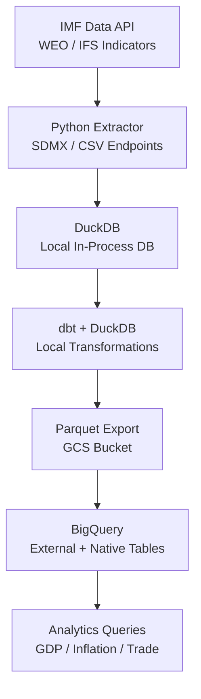

# IMF Economic Data ELT — DuckDB + BigQuery


Lightweight ELT pipeline for IMF World Economic Outlook data using DuckDB for local in-process transformations before loading to Google BigQuery. Demonstrates a modern, low-infrastructure approach to economic data processing — no Spark cluster needed.

## Architecture



## Features

- IMF Data API client supporting WEO, IFS, and BOP datasets
- DuckDB for blazing-fast local transformations without cluster overhead
- dbt + dbt-duckdb adapter for SQL transformation testing
- Seamless export from DuckDB → Parquet → BigQuery via GCS
- Covers 190+ countries, 50+ macroeconomic indicators
- Incremental loads: only new periods fetched on each run

## Tech Stack

| Layer | Technology |
|-------|-----------|
| Source | IMF Data API (SDMX 2.1) |
| Local Processing | DuckDB 0.10 |
| Transformation | dbt-duckdb |
| Cloud Store | Google Cloud Storage |
| Warehouse | Google BigQuery |
| Infrastructure | Docker (minimal) |

## Prerequisites

- Python 3.10+
- Google Cloud credentials (GCS + BigQuery)
- No cluster required — runs on a laptop

## Quick Start

```bash
git clone https://github.com/zulham-tech/imf-elt-duckdb-bigquery.git
cd imf-elt-duckdb-bigquery
pip install -r requirements.txt
cp .env.example .env  # add GCP credentials path
python pipeline/run.py --dataset WEO --year 2024
dbt run --profiles-dir .
```

## Project Structure

```
.
├── pipeline/
│   ├── extract/         # IMF API clients
│   ├── transform/       # DuckDB SQL transformations
│   └── load/            # GCS + BigQuery loader
├── dbt/
│   ├── models/          # dbt models for DuckDB
│   └── tests/           # Data quality tests
├── notebooks/           # EDA + visualization
├── .env.example
└── requirements.txt
```

## Author

**Ahmad Zulham Hamdan** — [LinkedIn](https://linkedin.com/in/ahmad-zulham-665170279) | [GitHub](https://github.com/zulham-tech)
